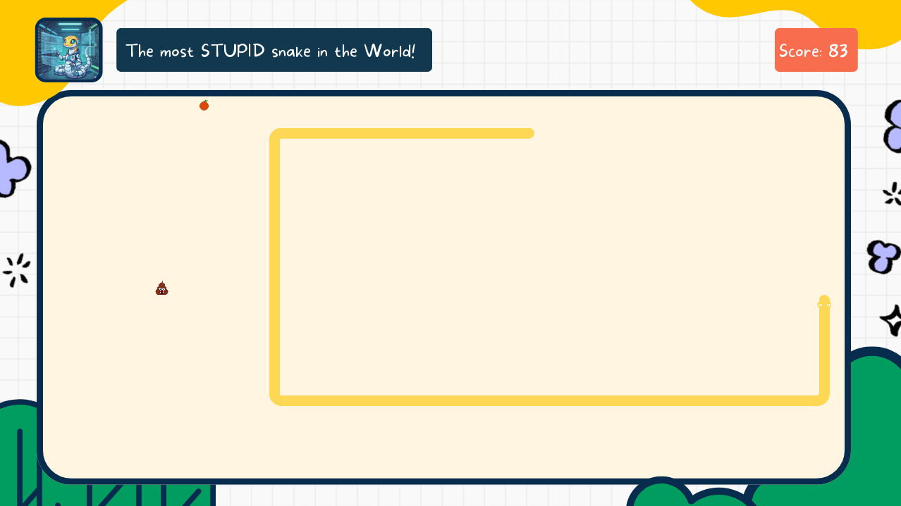
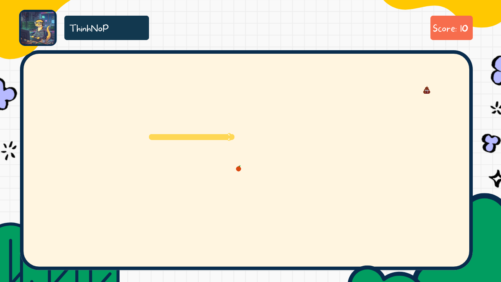
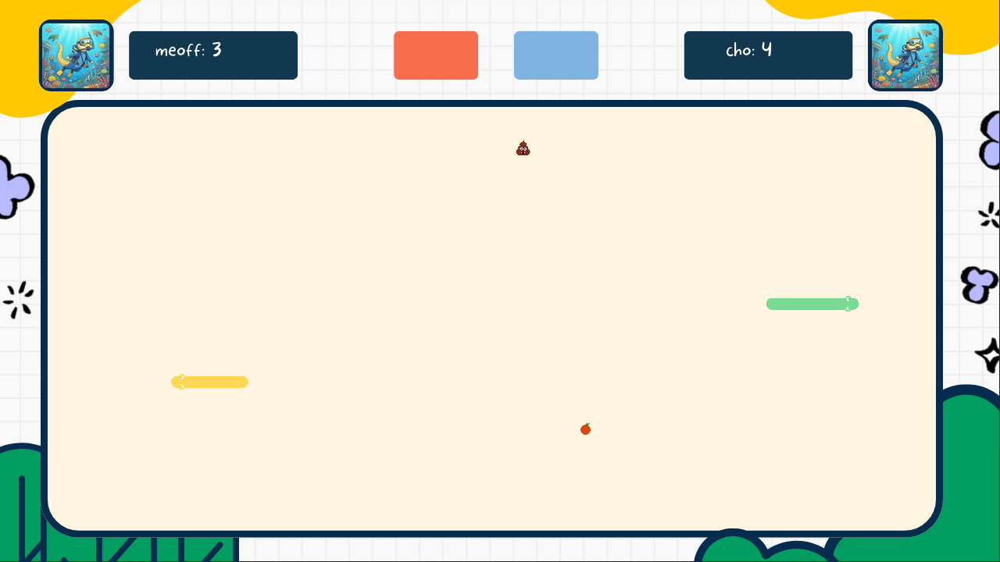

# 🐍 Snake Game - AI Powered with Deep Q-Learning


> Đồ án môn học **Nhập môn Công nghệ Thông tin** > **Khoa Công nghệ Thông tin - Trường Đại học Khoa học Tự nhiên, ĐHQG-HCM**

Dự án này là phiên bản hiện đại hóa của trò chơi **Rắn Săn Mồi (Snake)** kinh điển. Bên cạnh lối chơi truyền thống, game được tích hợp các chế độ chơi đa người (Co-op & PvP) và đặc biệt là **AI Agent** sử dụng thuật toán **Deep Q-Learning (DQN)** có khả năng tự học và chinh phục trò chơi.

---

## 🎮 Giao diện Demo

| Màn hình chính (Intro) | Chế độ AI (Deep Learning) |
| :---: | :---: |
|  |  |

| Chế độ 1 Người | Chế độ 2 Người |
| :---: | :---: |
|  |  |

---

## ✨ Tính năng nổi bật

### 1. Chế độ chơi đa dạng
* 👤 **Solo Leveling (1 Player):**
    * Lối chơi cổ điển với các mức độ khó: **Easy, Normal, Hard**.
    * **Cơ chế đặc biệt:** Tránh né các bãi "Poop" (chướng ngại vật) xuất hiện ngẫu nhiên. Nếu ăn phải sẽ bị trừ điểm và rút ngắn thân rắn.
* 🤝 **Play Together (Co-op):**
    * Chế độ phối hợp độc đáo trên cùng 1 bàn phím (Mũi tên & WASD).
    * **Cơ chế bất đối xứng:** Player 1 (Xanh) ăn Táo để ghi điểm, Player 2 (Vàng) ăn "Poop" để ghi điểm. Hai người chơi phải né nhau để cùng tồn tại.
* ⚔️ **Battle Royale (PvP):**
    * Chế độ sinh tồn đối kháng.
    * Rắn nào đâm vào tường, thân mình hoặc thân đối thủ trước sẽ thua cuộc. Điều kiện thắng: Đối thủ chết hoặc đạt 50 điểm trước.
* 🤖 **AI Mode (Auto Play):**
    * Sử dụng mạng nơ-ron nhân tạo (DQN) để tự động điều khiển rắn ăn mồi và tránh vật cản.

### 2. Hệ thống & Cài đặt
* 💾 **Save & Load System:** Lưu trữ trạng thái game (vị trí rắn, điểm số, chế độ chơi) ra file JSON để chơi tiếp sau này.
* 🎨 **Cá nhân hóa:** Người chơi có thể đặt tên (Nickname) và chọn Avatar trước khi vào game.
* 🔊 **Sound Manager:** Hệ thống âm thanh sống động, nhạc nền riêng cho từng chế độ và hiệu ứng ăn mồi/va chạm.
* ⚙️ **Input Queue:** Xử lý hàng đợi phím bấm để tránh lỗi rắn tự cắn mình khi người chơi thao tác quá nhanh trong một khung hình.

---

## 🛠️ Cài đặt & Môi trường

Đồ án khuyến khích sử dụng môi trường ảo (Virtual Environment) để quản lý thư viện.

### 1. Clone dự án
```bash
git clone https://github.com/vtpgamer17012007-arch/SnakeGame_GroupRanDoc
cd SnakeGame_GroupRanDoc
```

### 2. Cài đặt thư viện

```bash
pip install -r requirements.txt

```

*Các thư viện chính: `pygame`, `torch`, `numpy`, `matplotlib`.*

---

## 🚀 Hướng dẫn khởi chạy

### Khởi chạy Game

Để bắt đầu trò chơi:

```bash
python main.py

```

*(File `main.py` sẽ khởi tạo `SnakeApp` và chạy vòng lặp chính)*

### Huấn luyện AI (Training)

Nếu bạn muốn tự huấn luyện lại mô hình AI từ đầu:

```bash
python -m snake.rl.train_dqn

```

---

## 🧠 Kiến trúc AI (Deep Q-Learning)

Agent được xây dựng dựa trên thuật toán **Reinforcement Learning** với kiến trúc mạng nơ-ron tuyến tính (Feed Forward Neural Network).

### 1. Biểu diễn trạng thái (State Representation)

Thay vì dùng hình ảnh (CNN), AI "nhìn" môi trường thông qua một vector **16 chiều**:

* **Vision (8 chiều):** Sử dụng kỹ thuật **Raycasting** quét theo 8 hướng (Lên, Xuống, Trái, Phải và 4 hướng chéo) để đo khoảng cách đến tường, thân mình hoặc vật cản.
* **Food Direction (4 chiều):** Hướng tương đối của mồi so với đầu rắn (One-hot encoding).
* **Current Direction (4 chiều):** Hướng di chuyển hiện tại của rắn.

### 2. Mô hình Linear Q-Net

Mạng được định nghĩa trong `dqn_model.py` với kiến trúc:

| Layer | Type | Configuration | Output Shape |
| --- | --- | --- | --- |
| **Input** | Linear | Input Size: 16 (State size) | `(16)` |
| **Hidden** | Linear + ReLU | Size: 256 neurons | `(256)` |
| **Output** | Linear | Size: 4 (Action: Lên, Xuống, Trái, Phải) | `(4)` |

### 3. Cơ chế huấn luyện

* **Reward System:**
* Ăn mồi: `+20` điểm.
* Chết (đâm tường/thân): `-150` điểm.
* Dẫm phải bẫy (Poop): `-100` điểm.
* Tiến lại gần mồi: `+0.3` / Đi xa mồi: `-0.3` (Reward Shaping).


* **Strategy:** Epsilon-Greedy (Khám phá ngẫu nhiên ban đầu và dần chuyển sang khai thác tri thức).
* **Memory:** Replay Buffer lưu trữ 100,000 bước đi gần nhất để huấn luyện (Experience Replay).

---

## 📂 Cấu trúc thư mục

```text
SnakeGame_GroupRanDoc/
├── docs/                    # Tài liệu báo cáo & Hình ảnh demo
├── main.py                  # Entry point: Điểm khởi chạy chương trình
├── requirements.txt         # Danh sách thư viện cần thiết
├── snake/                   # Package mã nguồn chính
│   ├── app.py               # Quản lý vòng đời game & chuyển cảnh
│   ├── settings.py          # Cấu hình (Màu sắc, kích thước, tốc độ)
│   ├── save_manager.py      # Xử lý lưu/tải file JSON
│   ├── assets/              # Tài nguyên (Hình ảnh, Âm thanh, Font)
│   ├── core/                # --- LOGIC GAME (MODEL) ---
│   │   ├── env_snake.py     # Logic chơi đơn & AI (tính toán State/Reward)
│   │   ├── env_2p.py        # Logic chơi Co-op (2 người phối hợp)
│   │   └── env_2pvp.py      # Logic chơi PvP (Battle Royale)
│   ├── rl/                  # --- TRÍ TUỆ NHÂN TẠO ---
│   │   ├── agent_dqn.py     # AI Agent (Brain)
│   │   ├── dqn_model.py     # Mạng Nơ-ron (Linear QNet)
│   │   ├── train_dqn.py     # Script huấn luyện
│   │   └── memory.py        # Bộ nhớ Experience Replay
│   └── scenes/              # --- GIAO DIỆN (VIEW) ---
│       ├── intro.py         # Menu chính
│       ├── play_mode.py     # Chọn chế độ chơi
│       ├── solo_leveling.py # Màn hình chơi đơn
│       ├── battle_royale.py # Màn hình đối kháng
│       └── ...

```

---

## 👥 Tác giả

### HCMUS - NHÓM RẮN ĐỘC

| Thành viên | MSSV | Vai trò chính |
| --- | --- | --- |
| **Trần Nguyễn Trường Thịnh** | 25120235 | Logic rắn, Nền móng trò chơi (Game Core) |
| **Võ Thiên Phúc** | 25120222 | AI Engineer & Deep Learning |
| **Võ Ngọc Ánh Linh** | 25120202 | Phát triển chế độ 2 người chơi & Nâng cấp Level |
| **Trần Nguyễn Tấn Phát** | 25120218 | Thiết kế Giao diện Game (UI/UX) |
| **Trần Ánh Như** | 25120216 | Âm thanh (Sound Manager) & Media |
| **Văn Quốc Thịnh** | 25120236 | Hệ thống Lưu trữ (Save Game) |

Giảng viên hướng dẫn: **Thầy Lê Đức Khoan**.

---


---

<div align="center">
<sub>Built with ❤️ by TEAM RẮN ĐỘC</sub>
<br>
<sub>Built with ❤️ using Pygame & PyTorch</sub>
</div>
